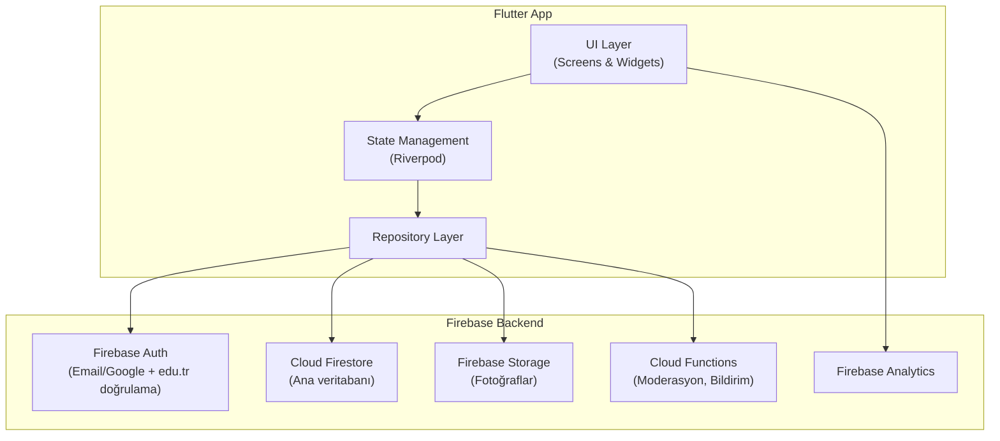
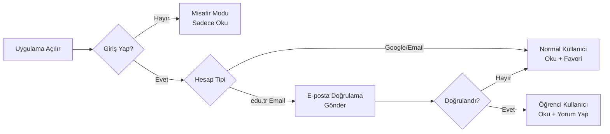
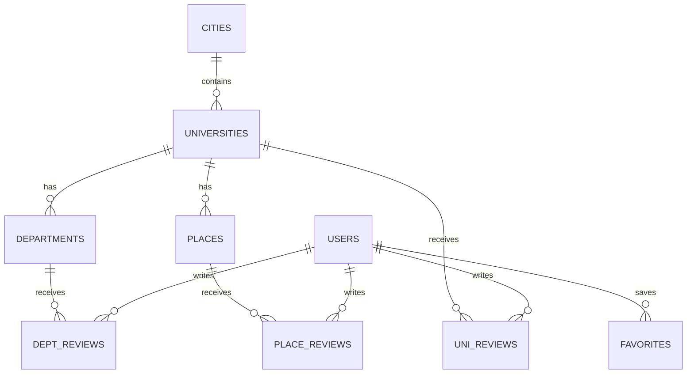
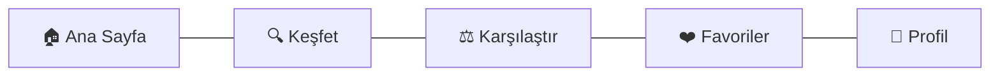

# 🎓 UniLife — Üniversite Yaşam Rehberi Uygulaması

> Lise son sınıf öğrencilerinin üniversite tercihlerini **sadece puanla değil, yaşam kalitesiyle** değerlendirmesini sağlayan mobil uygulama.

## 📋 Proje Özeti

| Bilgi | Detay |
|-------|-------|
| **Platform** | Android & iOS (Flutter) |
| **Backend** | Firebase (Auth, Firestore, Storage, Cloud Functions) |
| **Hedef Kitle** | Lise son sınıf öğrencileri (okuyucu), Üniversite öğrencileri (yorum yapan) |
| **MVP Kapsamı** | 10 şehir, şehir başı ~10 bölüm, kafeler, yurtlar, ders çalışma alanları |
| **Süre** | ~2.5-3 ay (Temmuz 2026 tercih dönemine kadar) |
| **Başlangıç** | Nisan 2026 ortası |
| **Hedef Çıkış** | Haziran 2026 sonu - Temmuz 2026 başı |

---

## 🏗️ Uygulama Mimarisi



### State Management: Riverpod
Flutter için **Riverpod** öneriyorum çünkü:
- Compile-time safety sağlar
- Test etmesi kolay
- Provider bazlı, widget tree'den bağımsız
- Flutter ekosisteminde en güncel ve popüler çözüm

> [!NOTE]
> Alternatif olarak **BLoC** da düşünülebilir ama MVP hızı için Riverpod daha pratik.

### Klasör Yapısı (Feature-First)
```
lib/
├── core/
│   ├── theme/              # Renk paleti, typography, tema
│   ├── constants/           # Sabitler, asset yolları
│   ├── utils/               # Yardımcı fonksiyonlar
│   └── widgets/             # Ortak widget'lar (rating bar, cards vb.)
├── features/
│   ├── auth/
│   │   ├── data/            # Firebase Auth repository
│   │   ├── domain/          # User model, auth state
│   │   └── presentation/    # Login, Register, Verify ekranları
│   ├── home/
│   │   ├── data/
│   │   ├── domain/
│   │   └── presentation/    # Ana sayfa, arama, keşfet
│   ├── university/
│   │   ├── data/
│   │   ├── domain/
│   │   └── presentation/    # Üniversite detay, bölüm listesi
│   ├── department/
│   │   ├── data/
│   │   ├── domain/
│   │   └── presentation/    # Bölüm detay, yorumlar
│   ├── places/
│   │   ├── data/
│   │   ├── domain/
│   │   └── presentation/    # Kafeler, yurtlar, çalışma alanları
│   ├── reviews/
│   │   ├── data/
│   │   ├── domain/
│   │   └── presentation/    # Yorum yazma, listeleme, puanlama
│   └── comparison/
│       ├── data/
│       ├── domain/
│       └── presentation/    # Üniversite karşılaştırma
├── router/                  # GoRouter navigasyon
└── main.dart
```

---

## 👤 Kullanıcı Tipleri & Kimlik Doğrulama



| Kullanıcı Tipi | Yetkiler |
|----------------|----------|
| **Misafir** | Üniversiteleri görüntüleme, yorumları okuma |
| **Normal Kullanıcı** | Misafir + favori listeleri, karşılaştırma kaydetme |
| **Doğrulanmış Öğrenci** | Normal + yorum yazma, puanlama, fotoğraf yükleme |

### edu.tr Doğrulama Akışı

1. Kullanıcı `ogrenci@universite.edu.tr` ile kayıt olur
2. Firebase Auth e-posta doğrulama linki gönderir
3. Doğrulama sonrası Firestore'da `isVerifiedStudent: true` ve `university: "..."` alanları güncellenir
4. Cloud Function, edu.tr domain'ini otomatik kontrol eder

> [!IMPORTANT]
> edu.tr doğrulaması kritik bir güven mekanizması. Kullanıcılar sadece **kendi üniversiteleri** hakkında yorum yapabilmeli. Bu şekilde sahte yorumların önüne geçilir.

---

## 🗄️ Firestore Veri Şeması

### Koleksiyon Yapısı



### Koleksiyon Detayları

#### `cities` koleksiyonu
```
cities/{cityId}
├── name: "Ankara"
├── plateCode: 6
├── imageUrl: "..."
├── universityCount: 15
└── description: "Başkent, öğrenci dostu şehir..."
```

#### `universities` koleksiyonu
```
universities/{uniId}
├── name: "Orta Doğu Teknik Üniversitesi"
├── shortName: "ODTÜ"
├── cityId: "ankara"
├── type: "devlet" | "vakıf"
├── foundedYear: 1956
├── imageUrl: "..."
├── coverImageUrl: "..."
├── location: GeoPoint(39.89, 32.78)
├── website: "https://www.metu.edu.tr"
├── description: "..."
├── facilities: ["kütüphane", "spor salonu", "havuz", ...]
├── ratings: {
│   ├── overall: 4.5
│   ├── campusLife: 4.7
│   ├── education: 4.3
│   ├── socialLife: 4.6
│   ├── transportation: 3.8
│   ├── food: 4.0
│   └── dormitory: 3.5
│   }
├── reviewCount: 234
├── departmentCount: 42
└── tags: ["kampüslü", "yeşil alan", "metro yakın"]
```

#### `departments` alt-koleksiyonu
```
universities/{uniId}/departments/{deptId}
├── name: "Bilgisayar Mühendisliği"
├── faculty: "Mühendislik Fakültesi"
├── baseScore2025: 485.32        # ÖSYM taban puanı
├── ranking2025: 3               # Sıralama
├── quota: 120
├── placedCount: 120
├── scoreType: "SAY"             # SAY, EA, SÖZ, DİL, TYT
├── duration: 4                  # Yıl
├── language: "İngilizce"
├── ratings: {
│   ├── overall: 4.2
│   ├── educationQuality: 4.0
│   ├── professorQuality: 3.8
│   ├── jobProspects: 4.5
│   ├── courseLoad: 3.2          # Düşük = ağır yük
│   └── internshipOpps: 4.3
│   }
├── reviewCount: 56
└── tags: ["İngilizce", "staj imkanı", "yüksek istihdam"]
```

#### `places` alt-koleksiyonu
```
universities/{uniId}/places/{placeId}
├── name: "Kampüs Kahvesi"
├── type: "cafe" | "dorm" | "study_area" | "library" | "sports"
├── description: "..."
├── imageUrls: [...]
├── location: GeoPoint(...)
├── address: "..."
├── priceRange: "₺₺"            # ₺, ₺₺, ₺₺₺
├── openHours: "08:00-22:00"
├── rating: 4.3
├── reviewCount: 45
├── tags: ["wifi", "priz", "sessiz", ...]
├── isPromoted: false            # İleride reklam için
└── promotionPriority: 0         # İleride sıralama için
```

#### `reviews` koleksiyonu (top-level, tüm yorum tipleri)
```
reviews/{reviewId}
├── type: "university" | "department" | "place"
├── targetId: "uni_odtu" | "dept_bilmuh" | "place_123"
├── universityId: "uni_odtu"     # Hızlı sorgulama için
├── userId: "user_abc"
├── userName: "Ahmet K."         # İlk harf + soyad baş harfi
├── userUniversity: "ODTÜ"       # Denormalize
├── rating: 4.5
├── categoryRatings: {           # Tipe göre değişir
│   ├── campusLife: 5
│   ├── education: 4
│   └── ...
│   }
├── comment: "Kampüs çok güzel..."
├── pros: ["Geniş kampüs", "Güzel kütüphane"]
├── cons: ["Ulaşım zor", "Yemekhane pahalı"]
├── imageUrls: [...]
├── likes: 23
├── isAnonymous: false
├── isApproved: true             # Moderasyon
├── createdAt: Timestamp
└── updatedAt: Timestamp
```

#### `users` koleksiyonu
```
users/{userId}
├── displayName: "Ahmet Kaya"
├── email: "ahmet@odtu.edu.tr"
├── photoUrl: "..."
├── isVerifiedStudent: true
├── university: "ODTÜ"
├── universityId: "uni_odtu"
├── department: "Bilgisayar Mühendisliği"
├── grade: 3                     # Sınıf
├── reviewCount: 5
├── favorites: [uniId1, uniId2, ...]
├── createdAt: Timestamp
└── lastLoginAt: Timestamp
```

> [!TIP]
> Firestore'da **denormalize** etmek önemli. Örneğin, her yorumda `userName` ve `userUniversity` tutmak, ekstra okuma maliyetinden kurtarır.

---

## 📱 Ekran Tasarım Listesi

### Ana Ekranlar (Bottom Navigation)



### Ekran Detayları

#### 1. 🏠 Ana Sayfa (Home)
- Hero banner (tercih dönemi geri sayım)
- Popüler üniversiteler (horizontal scroll)
- En çok yorum alan bölümler
- Son eklenen yorumlar feed'i
- Şehir bazlı hızlı erişim kartları

#### 2. 🔍 Keşfet (Explore)
- Arama çubuğu (üniversite, bölüm, şehir)
- Filtreler: Şehir, Tür (Devlet/Vakıf), Puan türü, Puan aralığı
- Harita görünümü (Google Maps entegrasyonu)
- Liste görünümü (kart bazlı)

#### 3. 🏫 Üniversite Detay Sayfası
- Cover fotoğraf + logo
- Genel bilgiler (kuruluş, tür, web sitesi)
- Rating kartları (kampüs, eğitim, sosyal hayat, ulaşım, yemek, yurt)
- Tab yapısı:
  - **Bölümler** → Taban puanlı bölüm listesi
  - **Yorumlar** → Üniversite hakkında yorumlar
  - **Mekanlar** → Kafeler, yurtlar, çalışma alanları
  - **Galeri** → Kampüs fotoğrafları

#### 4. 📚 Bölüm Detay Sayfası
- Bölüm adı, fakülte, süre, dil
- ÖSYM taban puan geçmişi (grafik)
- Rating kartları (eğitim kalitesi, hoca, iş imkanı, staj, ders yükü)
- Yorumlar listesi
- "Bu bölümü oku" öğrencilerden tavsiyeler

#### 5. ☕ Mekan Detay Sayfası
- Fotoğraf galerisi
- Bilgiler (adres, çalışma saatleri, fiyat aralığı)
- Özellikler (wifi, priz, sessiz ortam vb.)
- Yorumlar
- Haritada konum

#### 6. ⚖️ Karşılaştırma Sayfası
- 2-3 üniversiteyi yan yana kıyaslama
- Tüm rating kategorileri karşılaştırma tablosu
- Bölüm bazlı taban puan karşılaştırma
- Öne çıkan artılar/eksiler

#### 7. ✍️ Yorum Yazma Sayfası (Sadece edu.tr doğrulanmış)
- Kategori bazlı yıldız puanlama
- Artılar / Eksiler (chip bazlı seçim + özel yazma)
- Serbest metin yorum alanı
- Fotoğraf ekleme (opsiyonel)
- Anonim paylaşım seçeneği

#### 8. 👤 Profil Sayfası
- Kullanıcı bilgileri
- Yazdığı yorumlar
- Favori listesi
- edu.tr doğrulama durumu
- Ayarlar (bildirim, tema, dil)

#### 9. 🔐 Auth Ekranları
- Onboarding (3 sayfa tanıtım)
- Giriş yap (Google + Email)
- Kayıt ol
- edu.tr doğrulama akışı

---

## 📊 ÖSYM Veri Stratejisi

> [!WARNING]
> ÖSYM'nin resmi bir API'si bulunmuyor. Veri elde etme stratejisi dikkatli planlanmalı.

### Önerilen Yaklaşım (MVP için)

| Yöntem | Açıklama | MVP Uygunluğu |
|--------|----------|----------------|
| **YÖK Atlas** | yokatlas.yok.gov.tr'den veri çekme | ⭐⭐⭐ En iyi |
| **Manuel Giriş** | 10 şehir × ~10 bölüm = ~100 kayıt | ⭐⭐ Yedek plan |
| **Web Scraping** | Python script ile otomatik çekme | ⭐⭐ Riskli |

### Önerilen Plan:
1. **YÖK Atlas scraping**: Python ile yokatlas.yok.gov.tr'den taban puanları, kontenjanları çek
2. **JSON'a dönüştür** ve Firebase'e toplu yükle (Firestore batch write)
3. **Yıllık güncelleme** mekanizması kur (her ÖSYM sonuç açıklaması sonrası)

> [!NOTE]
> MVP için sadece en güncel yılın verileri yeterli. İlerleyen versiyonlarda yıllık trend grafikleri eklenebilir.

---

## 💰 Monetizasyon Stratejisi (İleri Aşama)

MVP'de monetizasyon yok, ama altyapıyı şimdiden hazırlıyoruz:

### Aşama 1 (MVP Sonrası)
- **Promosyonlu Mekanlar**: Kafeler/restoranlar ücretli olarak üst sırada gösterilir
  - Firestore'da `isPromoted` ve `promotionPriority` alanları zaten tasarımda var
  - Aylık/yıllık abonelik modeli

### Aşama 2 (Büyüme)
- **Google AdMob**: Uygulama içi banner reklamlar (feed aralarında)
- **Premium Özellikler**: Detaylı istatistikler, gelişmiş karşılaştırma
- **Üniversite Sponsorluk**: Üniversitelerin kendi profillerini özelleştirmesi

---

## 🗓️ Sprint Planı (10 Hafta)

### Sprint 0: Hazırlık (Hafta 1: 15-21 Nisan)
- [x] Fikir ve kapsam netleştirme
- [ ] Flutter proje kurulumu
- [ ] Firebase projesi oluşturma ve konfigürasyon
- [ ] Klasör yapısı ve paket bağımlılıkları
- [ ] Tema sistemi (renkler, fontlar, spacing)
- [ ] Tasarım sistemi (ortak widget'lar)
- [ ] Firestore güvenlik kuralları taslağı

### Sprint 1: Auth & Veri Altyapısı (Hafta 2-3: 22 Nisan - 5 Mayıs)
- [ ] Firebase Auth entegrasyonu (Google + Email)
- [ ] edu.tr doğrulama akışı (Cloud Function)
- [ ] User model ve repository
- [ ] Onboarding ekranları (3 sayfa)
- [ ] Login / Register ekranları
- [ ] ÖSYM/YÖK Atlas veri çekme scripti (Python)
- [ ] Firestore'a ilk veri yükleme (10 şehir + üniversiteler)

### Sprint 2: Üniversite & Bölüm (Hafta 4-5: 6-19 Mayıs)
- [ ] Ana sayfa tasarımı ve implementasyonu
- [ ] Şehir listesi ve üniversite listesi
- [ ] Üniversite detay sayfası (bilgiler + tab yapısı)
- [ ] Bölüm listesi ve detay sayfası
- [ ] Arama ve filtreleme fonksiyonu
- [ ] Taban puan gösterimi

### Sprint 3: Yorum Sistemi (Hafta 6-7: 20 Mayıs - 2 Haziran)
- [ ] Yorum yazma ekranı (kategori puanlama + metin)
- [ ] Yorum listeleme (sıralama, filtreleme)
- [ ] Like/beğeni sistemi
- [ ] Moderasyon altyapısı (Cloud Function ile basit filtre)
- [ ] Anonim yorum seçeneği
- [ ] Rating hesaplama ve güncelleme

### Sprint 4: Mekanlar & Karşılaştırma (Hafta 8-9: 3-16 Haziran)
- [ ] Mekan listesi (kafe, yurt, çalışma alanı)
- [ ] Mekan detay sayfası
- [ ] Mekan yorum sistemi
- [ ] Karşılaştırma sayfası (2 üniversite yan yana)
- [ ] Favori listesi
- [ ] Push notification altyapısı

### Sprint 5: Polish & Yayın (Hafta 10: 17-30 Haziran)
- [ ] UI/UX iyileştirmeler ve animasyonlar
- [ ] Performans optimizasyonu
- [ ] Bug fix marathon
- [ ] Google Play Store hazırlığı (screenshots, açıklama, ikon)
- [ ] App Store hazırlığı (Apple Developer Account gerekli — 99$/yıl)
- [ ] Beta test (arkadaş grubunda) 
- [ ] **Yayın! 🚀**

---

## 📦 Paket Bağımlılıkları (pubspec.yaml)

| Paket | Kullanım |
|-------|----------|
| `flutter_riverpod` | State management |
| `firebase_core` | Firebase temel |
| `firebase_auth` | Kimlik doğrulama |
| `cloud_firestore` | Veritabanı |
| `firebase_storage` | Fotoğraf depolama |
| `firebase_analytics` | Analitik |
| `firebase_messaging` | Push notification |
| `go_router` | Navigasyon |
| `cached_network_image` | Görsel önbellekleme |
| `flutter_rating_bar` | Yıldız puanlama |
| `shimmer` | Loading animasyonları |
| `google_maps_flutter` | Harita entegrasyonu (opsiyonel) |
| `fl_chart` | Taban puan grafikleri |
| `image_picker` | Fotoğraf seçme |
| `share_plus` | Paylaşım |
| `url_launcher` | Web sitesi açma |
| `intl` | Tarih/sayı formatlama |

---

## 🎨 Tasarım Kararları

### Renk Paleti (Öneri)
- **Primary**: `#6C63FF` (Modern mor — genç hedef kitleye uygun)
- **Secondary**: `#FF6584` (Pembe-mercan vurgu rengi)
- **Background Dark**: `#1A1A2E` (Koyu mod)
- **Background Light**: `#F8F9FA`
- **Surface**: `#16213E`
- **Accent**: `#00D9FF` (Turkuaz highlight)

### Font
- **Başlık**: Poppins (Bold/SemiBold)
- **Gövde**: Inter (Regular/Medium)

### Tasarım İlkeleri
- Dark mode öncelikli (gençler dark mode seviyor)
- Glassmorphism kartlar
- Smooth animasyonlar (Hero, Fade, Slide)
- Bottom sheet'ler (modal yerine)
- Skeleton loading (shimmer efekti)

---

## 🔒 Güvenlik Kuralları (Firestore)

```
// Temel kurallar özeti
- Herkes okuyabilir (üniversite, bölüm, mekan verileri)
- Sadece giriş yapmış kullanıcılar favori ekleyebilir
- Sadece edu.tr doğrulanmış kullanıcılar yorum yazabilir
- Kullanıcılar sadece kendi üniversiteleri hakkında yorum yazabilir
- Kullanıcılar sadece kendi yorumlarını düzenleyebilir/silebilir
- Admin rolü: tüm CRUD işlemleri + moderasyon
```

---

## ⚠️ Riskler ve Çözümler

| Risk | Olasılık | Etki | Çözüm |
|------|----------|------|--------|
| ÖSYM/YÖK Atlas verisi çekilemez | Orta | Yüksek | Manuel giriş yedek planı (100 kayıt) |
| App Store onay süreci uzar | Yüksek | Orta | Önce Android'de yayınla, iOS paralel devam etsin |
| Yeterli yorum toplanamaz | Yüksek | Yüksek | Başlangıçta kendi üniversitendeki arkadaşlardan seed yorum al |
| edu.tr doğrulama problemleri | Düşük | Orta | Bazı üniversitelerin farklı domain'leri olabilir, whitelist tut |
| Zaman yetmezliği | Orta | Yüksek | Mekanlar (Sprint 4) MVP'den çıkarılabilir, v2'ye bırakılabilir |

---

## 🔮 İleri Versiyon Fikirleri (Post-MVP)

- 📱 **Üniversite günlükleri**: Öğrencilerin günlük hayatlarını paylaştığı kısa videolar
- 🤖 **AI Tercih Asistanı**: Puanına ve tercihlerine göre üniversite önerisi
- 🗺️ **Kampüs Turu**: 360° sanal kampüs turu
- 📊 **Trend Analizi**: Yıllar bazında taban puan değişim grafikleri
- 💬 **Soru-Cevap**: Adayların öğrencilere direkt soru sorabilmesi
- 🎓 **Mezun Takibi**: Bölüm mezunlarının kariyer bilgileri
- 🏪 **Öğrenci İndirimleri**: Çevredeki kampanya/indirim bilgileri

---

## User Review Required

> [!IMPORTANT]
> **Apple Developer Account**: iOS'ta yayınlamak için yıllık 99$ Apple Developer ücreti gerekiyor. Bunu göz önünde bulundur. Alternatif olarak MVP'yi sadece Android'de çıkarıp iOS'u sonraya bırakabilirsin.

> [!IMPORTANT]
> **Google Maps API**: Harita entegrasyonu için Google Maps API key gerekiyor, ücretsiz kotası var ama aşılırsa ücretli. MVP'de haritayı **opsiyonel** tutabilir, sadece adres gösterebiliriz.

> [!WARNING]
> **Yorum Seed Verisi**: Uygulama boş yorumlarla çıkarsa kullanıcılar geri dönmez. Yayın öncesi en az her üniversite için 5-10 seed yorum lazım. Kendi üniversite arkadaş çevrenden başlayabilirsin.

## Open Questions

1. **Uygulama adı**: "UniLife" öneriyorum ama başka bir isim tercihin var mı? (Store'da benzersiz olmalı)
2. **Apple Developer Account**: 99$/yıl ödemeye hazır mısın yoksa sadece Android ile mi başlayalım?
3. **Dark mode / Light mode**: Sadece dark mı, ikisi birden mi?
4. **Dil**: Sadece Türkçe mi, yoksa İngilizce desteği de olsun mu?
5. **Admin paneli**: Yorum moderasyonu için basit bir web paneli gerekecek. Bunu da Flutter Web ile mi yapalım, yoksa Firebase Console yeterli mi başlangıçta?
6. **Harita**: Google Maps entegrasyonu MVP'de gerekli mi, yoksa v2'ye bırakalım mı?
